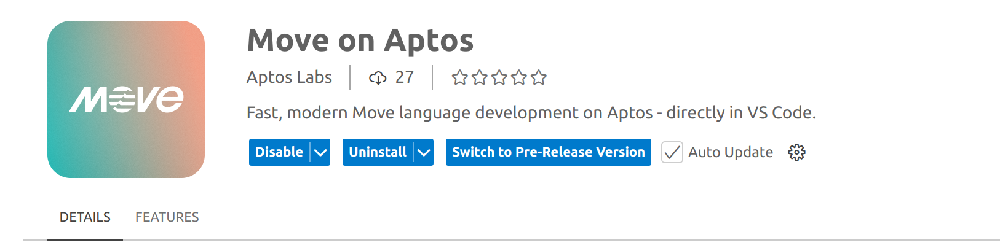

# Move on Aptos Language Extension

This is the official Visual Studio Code (and Cursor) extension for [developing smart contracts in the Move language on the Aptos blockchain](https://aptos.dev/en/build/smart-contracts).

Built from the ground up, it delivers a modern and performant development experience, offering essential features like semantic highlighting, real-time diagnostics, auto-formatting and seamless integration with the rest of the Aptos toolchain - all designed to help developers build and test Move contracts with ease and confidence.

Actively maintained by the Aptos team, this extension is designed to evolve alongside the Move language and supports both developers who are new to Move, and those building more complex applications.

## Features

- Semantic Highlighting
- Go to Definition  
- Find All References & Symbol Renaming
- Type and Documentation on Hover
- Contextual Auto-Completion
- Inlay Hints for Types and Function Parameters


- Real-Time Diagnostics
- [Code suggestions](docs/quickfixes.md)
- `movefmt` Integration


- Run `#[test]` functions
- Check modules and functions with Move Prover

## Installation

We publish releases both on [VSCode Marketplace](https://marketplace.visualstudio.com/items?itemName=AptosLabs.move-on-aptos) and [OpenVSX](https://open-vsx.org/extension/aptoslabs/move-on-aptos).

We also publish `nightly` pre-releases, which are built from `main` branch every night. To use those, select **Switch to Pre-Release Version** from your editor's Extensions View.



### Build from sources

Clone the repo, then run:
```
cargo run -p xtask -- install --server --client
```
(or just `cargo xtask install --server --client`, see https://github.com/matklad/cargo-xtask) 

The command builds `move-on-aptos.vsix` extension file and installs it into your VSCode. 
Then it runs `cargo install` to build and install language server.

Put

```
"move-on-aptos.server.path": "~/.cargo/bin/aptos-language-server",
```

to your `settings.json` to point the extension to your locally built language server.

### Build from sources: Cursor AI editor

If you use https://www.cursor.com/ AI editor, you need to do a bit more work.

Run the installation command above. The result would be a `./editors/code/move-on-aptos.vsix` vscode extension package.
Then install it from the editor using the `"Install from VSIX..."` command.

## Configuration

> [!NOTE]
> Extension by itself won't download your dependencies from the network.
>
> If you see `unresolved reference` errors on the `AptosFramework` imports -
> try running `aptos move compile` once on your project to download your remote dependencies.

This extension provides configurations through VSCode's configuration settings.
All configurations are under `move-on-aptos.*`.

See the [configuration docs](https://github.com/aptos-labs/move-vscode-extension/blob/main/docs/configuration.md)
for more information.

## Roadmap

* More error highlighting:
  - Implement more errors from the Aptos Move compiler (like ability checking)
  - Implement lints from the `aptos move lint` with extension-provided quickfixes.

* Working with imports:
  - Detect unused imports and remove them with "Organize Imports" VSCode feature. 
  - Show completion items not imported in the current module, create `use` statements for those automatically.

* Integration with the `aptos-cli` commands: compile packages, publishing modules and executing transactions. 

* `Move.toml` support.

* AI integration (via MCP server). 

## Contributing

We welcome feedback, bug reports, and contributions from the community!

If you run into a bug, usability issue, or have a feature request, please don’t hesitate to [open an issue](../../issues). This will help us improve the experience for everyone.

That said, this project is still in its early stages, and many parts of it are evolving quickly. If you're planning to work on a larger change or feature, we encourage you to start a discussion or open an issue first. This helps ensure alignment and avoid unnecessary rework.

## Acknowledgements

This project is inspired by [rust-analyzer](https://github.com/rust-lang/rust-analyzer).

Portions of the code in this project are derived from rust-analyzer and are used under 
the terms of the Apache License, Version 2.0.

We thank the rust-analyzer contributors for their work and inspiration.