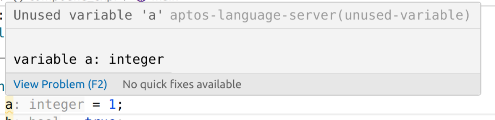

## Recommended configuration for the Move package directories

LSP is somewhat limited in what it can actually do, so some of the settings need to be specified manually.

### Mark Move Library sources read-only

Add the following to your `settings.json`:

```json5
    "files.readonlyInclude": {
        "**/build/*/sources/**/*.move": true,
        "**/.move/**/*.move": true,
    }
```

### Auto-close `b"` and `x"` properly

```json5
    "[move]": {
        "editor.wordSeparators": "`~!@#$%^&*()-=+[{]}\\|;:'\",.<>/?bx",
    },
```

A bunch of symbols in the config value are the defaults, we're adding `b` and `x` symbols for the string prefixes.

## Configuration

### Diagnostics

Extension provides a number of diagnostics, from hard errors like "unresolved reference" to style lints.
Some of those might be less useful than others for different coding styles, so there's an escape hatch to disable those:

```json5
{
    "move-on-aptos.diagnostics.disabled": [],
}
```
where values are diagnostic codes from the error messages, like `unused-variable` here:



### Inlay hints

Type hints for the let statements and lambda parameters are supported.
```move
module 0x1::m {
    fun main() {
        let a/*: integer*/ = 1;
        let f: |u8| u8 = |e/*: u8*/| e;
    }
}
```

To disable those, use:

```json5
{
    "move-on-aptos.inlayHints.typeHints.enable": false,
}
```

### Formatting (works with `movefmt` >= 1.2.1)

Specify a path to the `movefmt` executable and extra args (like a `--config-path`) if necessary:
```json5
{
    "move-on-aptos.movefmt.path": "~/code/movefmt/target/release/movefmt",
    "move-on-aptos.movefmt.extraArgs": [],
}
```

Formatting on Save can be enabled in VSCode with
```json5
{
    "editor.formatOnSave": true,
}
```

## Debugging

It's useful to enable INFO logging level, it's not very chatty and could provide with a valuable information to debug:

```
    "move-on-aptos.server.extraEnv": { "RA_LOG": "info" },
```

## Additional commands

### `aptos-language-server diagnostics --apply-fixes all`

Run server diagnostics on the file (or package directory). If `--apply-fixes` is provided, automatically applies available autofixes:

[See available diagnostics with auto-fixes](quickfixes.md)

```shell
  $ aptos-language-server diagnostics --apply-fixes ./aptos-stdlib/sources/cryptography/keyless.move 
processing package 'aptos-stdlib', file: /home/mkurnikov/code/aptos-core/aptos-move/framework/aptos-stdlib/sources/cryptography/keyless.move
note[replace-with-method-call]: Can be replaced with method call
   ┌─ /home/mkurnikov/code/aptos-core/aptos-move/framework/aptos-stdlib/sources/cryptography/keyless.move:67:17
   │
67 │         assert!(string::bytes(&iss).length() <= MAX_ISSUER_UTF8_BYTES_LENGTH, error::invalid_argument(E_INVALID_ISSUER_UTF8_BYTES_LENGTH));
   │                 ^^^^^^^^^^^^^^^^^^^
   │
   ┌─ /home/mkurnikov/code/aptos-core/aptos-move/framework/aptos-stdlib/sources/cryptography/keyless.move:67:17
   │
67 │         assert!(iss.bytes().length() <= MAX_ISSUER_UTF8_BYTES_LENGTH, error::invalid_argument(E_INVALID_ISSUER_UTF8_BYTES_LENGTH));
   │                 ^^^^^^^^^^^ after fix


```
