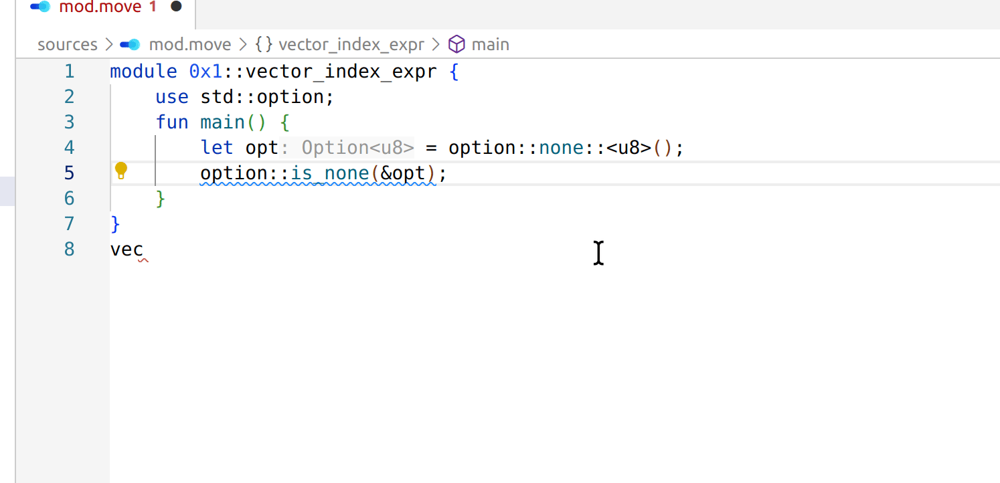
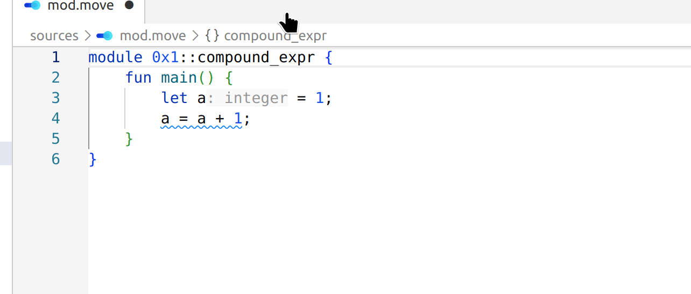
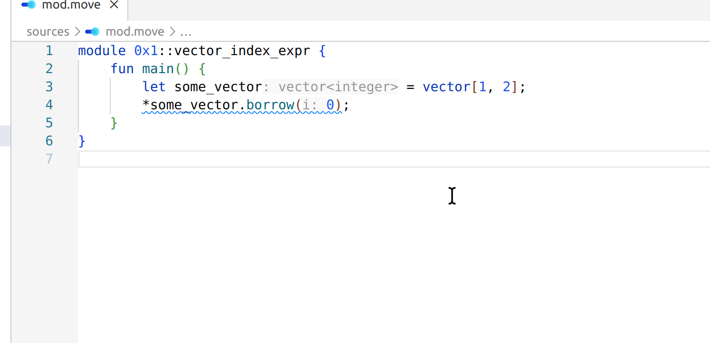
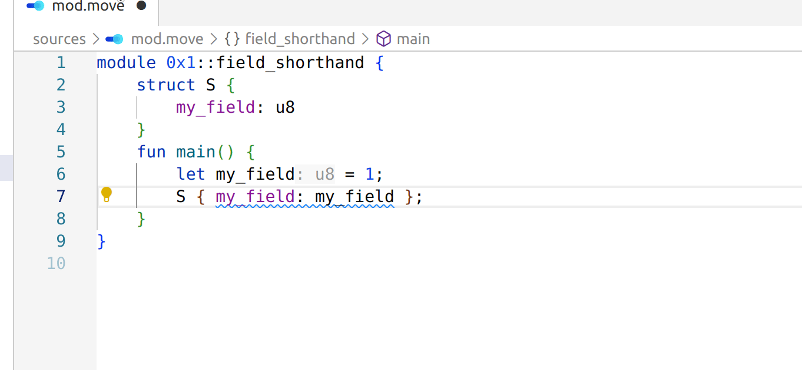

## Code suggestions (with fixes)

### Use method call notation

### Use compound assignment expression

### Use vector index expr

Detects expressions of form `*vector::borrow(&some_vector, index)` and `*some_vector.borrow(index)`, 
which can be converted to `some_vector[index]`. 

### Use field initialization shorthand

Detects struct literal fields which could be written in shorthand form.

### Redundant integer type cast

Detects expressions like `number as u8`, where `number` is already of type it's being casted to.

