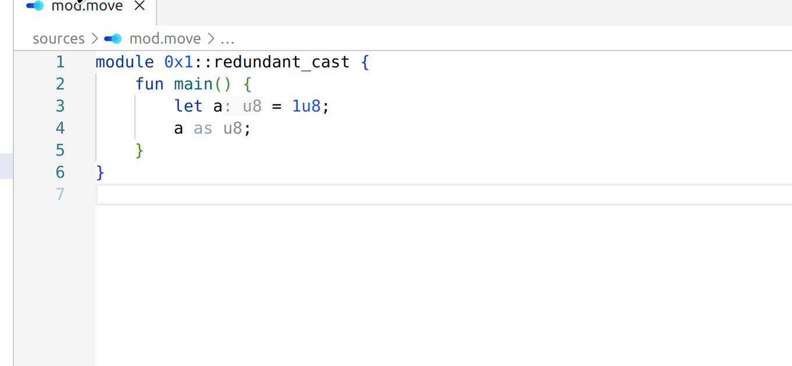

## Code suggestions (with fixes)

> [!NOTE]
> See `aptos-language-server diagnostics`
> command (https://github.com/aptos-labs/move-vscode-extension/blob/main/docs/configuration.md#additional-commands)
> on how to apply quickfixes from the CLI.

### Use method call notation

**Code**: `replace-with-method-call`

### Use compound assignment expression

**Code**: `replace-with-compound-expr`

### Use vector index expr

**Code**: `replace-with-index-expr`

Detects expressions of form `*vector::borrow(&some_vector, index)` and `*some_vector.borrow(index)`,
which can be converted to `some_vector[index]`.

### Use field initialization shorthand

**Code**: `use-struct-lit-field-shorthand`, `use-struct-pat-field-shorthand`, `use-schema-lit-field-shorthand`

Detects struct literal fields which could be written in shorthand form.

### Redundant integer type cast

**Code**: `remove-redundant-cast`

Detects expressions like `number as u8`, where `number` is already of type it's being casted to.

### Add `_` prefix to the variable name

**Code**: `rename-with-underscore-prefix`

Quickfix available for unused variables, prefixes it with `_`. 

